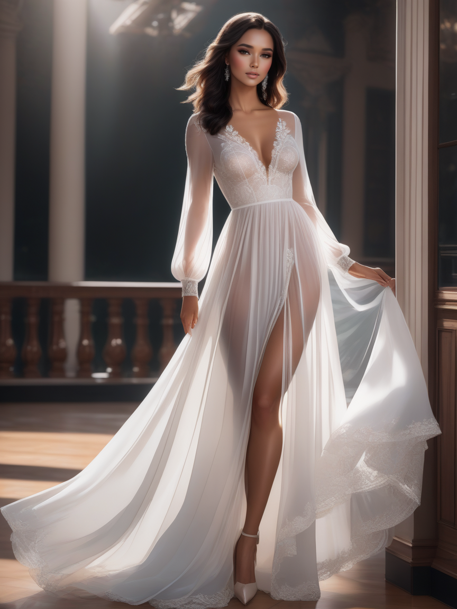
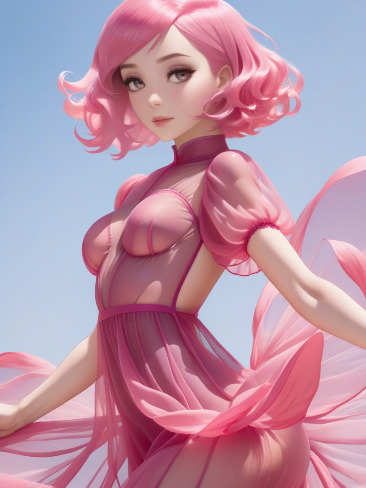

# LoRA - XL Diaphanous Dress

Open-sourced LoRA configuration and training data for Stable Diffusion XL.

| `dreamshaperXL10_alpha2Xl10`                                  | `animeArtDiffusionXL_alpha3`                           |
|---------------------------------------------------------------|-----------------------------------------------|
|  |  |

_It's like wearing nothing at all! nothing at all! nothing at all!_

Light, silky dresses made from sheer fabrics that drape in ethereal ripples over
the body.

https://civitai.com/models/168599/xl-diaphanous-dress

## Parameters

Recommended weight: `0.8`

Activation tags: `diaphanous dress`

Secondary tags:

* `<color> diaphanous dress`
* `puffy sleeves`
* `long dress`

## Version History

#### v1.0

* Release

## Training

* Load config into [Kohya SS](https://github.com/bmaltais/kohya_ss)
* Download a base model.
* Download or create regularization images for the chosen model.
  For SDXL Base 1.0 use [reg-sdxl-1girl](https://github.com/n15g/reg-sdxl-1girl).
* Update paths for the model, image, output and logging folders
* Adjust the batch size for your GPU

| VRAM       | 24 GiB | 12 GiB | 8GiB |
|------------|--------|--------|------|
| Batch Size | 10     | 4      | 2-3  |
